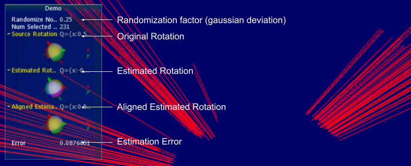
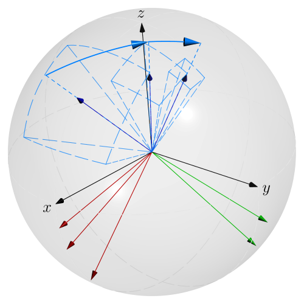
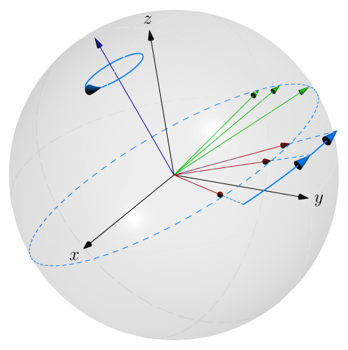
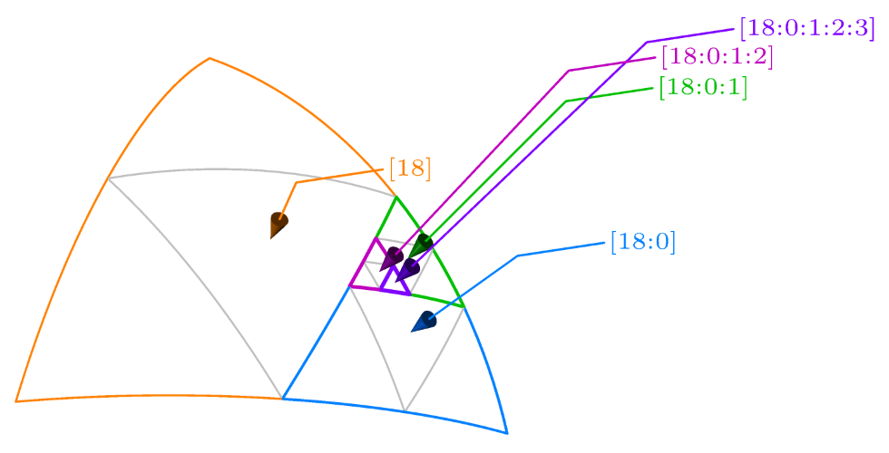
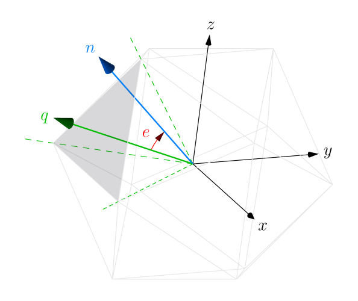

# CUDA Photogrammetry Rotation Estimation

This project implements a method for the estimation of the rotation of a geometric dataset based on its normals. It is designed with efficiency in mind, and implemented here using CUDA (and a little OpenGL). For example, we could imagine use cases in the field of photogrammetry. _Disclaimer: I developed this method on my own, I have no reason to think I'd be the first one to come up with something similar._

## Demo
The demo is a test implementation of the method. Buffers of normals are procedurally generated based on an original rotation and a gaussian noise. We can observe the original rotation, the estimated rotation, its aligned transformation, and the estimation error with respect to the original rotation.



We'll elaborate below on the calculation of error. Noise is an important factor as it allows us to gauge the resilience of the method to noisy datasets or irregular / curved geometries.

Code structure:

* `Demo.cpp`, the main application code including setup and update loop.
* `EstimateRotation.(h|cu)`, the rotation estimation code, includes CUDA kernels. Fully commented.
* `DeviceBuffer.cu`, a class introduced to simplify device buffer management.
* `Utilities.(h|cpp)`, utilities for testing and error measurement. Also features `DispatchArgs`, a simple struct designed to optimize the use of GPU streaming multiprocessors.
* `Tests.(h|cpp)`, some proto unit tests used along development.

## Algorithm

**The key insight of the algorithm is that most real world geometries will have normals whose dominant directions reflect its rotation.** 
Remember that the column vectors of an orthogonal rotation matrix are orthogonal and form an orthogonal basis. So as we gradually estimate those vectors, _think of it as if we were evaluating the rotation matrix column by column._

### Estimating Rotation

Rotation estimation amounts to finding a set of orthogonal vectors best aligned with the normals. We proceed in two steps. Both estimation steps iteratively select candidate rotations based on their fit to the dataset of normals. For each normal of the dataset, a score is computed with respect to the candidate rotation. These scores are then summed using [reduction](https://developer.download.nvidia.com/assets/cuda/files/reduction.pdf). At each iteration, we reduce the angular range within which we search for candidate rotations, to converge on a good solution.

Both estimation algorithms are structured as follows:
```
- identify a set of initial rotations to examine
- select the best one
for each iteration step:
| for each neighboring candidate rotation:
| | - calculate a score for each normal
| | - sum these scores
| | if summed score is above current best candidate:
| | | overwrite best candidate
| reduce the angular span used to search for neighboring candidate rotations
```

#### Finding One Basis Vector
We first look for one basis vector. To find it, we try and fit a plane passing through the origin to the set of normals. (_Note: in most real world usages, this plane corresponds the floor._) We begin the plane's normal estimation by iterating over pitch and yaw by increments of 1/4th PI. We do not care about the sign of this vector, only its direction. So we can evaluate the combinations lying on the upper hemisphere of the unit sphere only. We then iteratively refine our estimation by evaluating neighboring pitch and yaw combinations, dividing the angular range by 2 at each step. For each selected rotation, we evaluate 8 neighbors. (Those are combinations of one step in each direction for both pitch and yaw.)

In the figure below we illustrate the iterative search for the first basis vector. We drew the gradual reduction of the angular span.



Candidate selection depends on the calculation of a score for a dataset's normal. Here score is maximized if the normal lies on the plane *or* is aligned with the plane's normal.
```
auto normal = normals[index];
auto proj = glm::dot(basis, normal);
auto projectDirOnNormal = basis * proj; // Alignment with the plane's normal.
auto projectDirOnPlane = normal - projectDirOnNormal; // Alignment with the plane itself.
// We then use max() as both alignments are valuable.
scores[index] = glm::max(squareLength(projectDirOnNormal), squareLength(projectDirOnPlane));
```

#### Finding The Remaining Two Basis Vectors
Once the first basis vector has been found, we find 2 orthogonal vectors to it. They lie on the plane described previously. The first vector is found using components swaps, the second using a cross product. We then rotate them in order to find the best rotation. As previously, this calculation is done iteratively. We narrow the angular range at each step to converge on a good solution. Note that here we only search for yaw.

In the figure below we illustrate the rotation of the basis along its first found vector.


Normal's scores depend on their alignment with basis vectors. A normal aligned with the basis can only be aligned with one of its vector, hence the use of `max()`.
```
auto normal = normals[index];
auto x = square(glm::dot(normal, glm::column(basis, 0)));
auto y = square(glm::dot(normal, glm::column(basis, 1)));
auto z = square(glm::dot(normal, glm::column(basis, 2)));
scores[index] = glm::max(x, glm::max(y, z));
```

### Error Calculation
The algorithm finds an orthogonal basis, a rotation, fitting the set of normals. But it is insensitive to the order of these basis vectors or their sign. So we cannot estimate the error simply by comparing the original rotation with the estimated one. We must "realign" the estimated rotation with the original one. That is, we swap and flip the basis vectors we found to minimize distance with the original rotation.

It is implemented in `Utilities.cpp` in `getMinDistChangeOfBasis`. We evaluate a basis M so that `dist(rot-estimated, rot-original) > dist(rot-estimated * M, rot-original)`. The axes of this matrix M must be aligned with the standard basis vectors ([1, 0, 0], ...). We calculate the difference between the original and estimated rotation, and sort of "snap" it to the standard basis vectors. 

To do so we test the difference matrix against the possible set of axes permutations. (As the axes we test against only have one non zero component, we can spare ourselves a full dot product.) Having found this basis, we can then calculate error as the rotation matrices distance using the method described [here](http://www.boris-belousov.net/2016/12/01/quat-dist/#using-rotation-matrices). 

## Implementation
Our implementation anticipates high volumes of data and performance constraints. We handle this by encoding normals, a process akin to **quantization**. We use an icosphere, that is, a recursively subdivided icosahedron. We pick this geometry as it allows us to maintain a consistent quantization error regardless of the quantized vector direction. To encode a vector, we look for the icosphere's face whose normal is most closely aligned with the vector. We infer an index from the icosphere's face. At subdivision depth 0 (icosahedron), we have 20 faces, requiring 5 encoding bits. Then for each subsequent subdivision level, we need 2 more bits, as each face is subdivided into 4 subfaces. 

In the figure below, we illustrate the recursive subdivision process, and the corresponding indices from which a unique index is inferred.


In the above illustration we describe the deepest subdivision face as having indices `18, 0, 1, 2, 3`. 18th face of the icosahedron, then 0th subface, then 1st subface, and so on. Translating it to an index:
```
// Start with icosahedron face index.
uint32_t index = 18u;
// Then for each subdivision level,
// shift by 2 bits and encode the subdivision face index.
index = (index << 2u) | 0u; 
index = (index << 2u) | 1u; 
index = (index << 2u) | 2u; 
index = (index << 2u) | 3u; 
```

The resulting index is that of the bin whose increment will reflect the vector's encoding. Reciprocally, we can reconstruct vectors based on our quantization bins. The index itself is enough to reconstruct direction, and we map the bin's count to the reconstructed vector's magnitude. Quantization error is represented by the angle between the original vector and the corresponding face normal. 

In the figure below *n* represents the vector, *q* its corresponding quantization, and *e* the quantization error.


The algorithm described in the previous section operates on the set of decoded vectors whose magnitude is above a given threshold. This method allows us to drastically reduce the volume of data processed during the estimation steps, so that we can process very high volumes of data in real time. The volume of data only adds to the cost of the quantization step.

 _Note: our demo does not use specific CUDA streams and has more synchronization points than a production implementation would require. These are convenient in the context of a demo._
